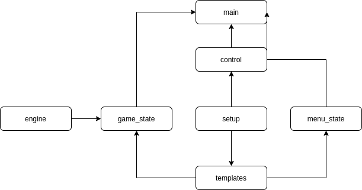

# 2048

Dokumentace zápočtové aplikace.

Téma: Hra 2048

Autor: [Daniel Josef](https://github.com/DanJsef)

Cvičící: [Josef Starýchfojtů](https://github.com/starychfojtu)

# Ovládání

Primárním ovladačem celé aplikace je klávesnice. Myší lze pouze aplikaci ukončit, kliknutím na zavírací pole jako u běžných aplikací.

**Používané klávesy**
|možnost 1|možnost 2 | funkce |
|-|-|-|
| W | arrow_up | pohyb nahoru |
| A | arrow_left | pohyb vlevo |
| S | arrow_down | pohyb dolů |
| D | arrow_right | pohyb vpravo |
| enter | - | potvrzení |

## Menu

V každém aplikačím menu jsou podsebou zobrazené možnosti a aktuálně vybraná možnsot je označena kurzorem (X). Mezi jednotlivými možnostmi lze přepínat příslušnými klávesami pro pohyb nahoru a dolů. Zvolenou možnost lze potvrdit příslušnou klávesou pro potvrzení.

V hlavním menu si hráč volí obtížnost. (Hodnota, kterou je třeba získat k vítězství)

## Hra

Samotná hra probíhá spojováním políček se stejnými hodnotami, přesouváním vždy všech polí jedním směrem. Směr pohybu v každém kole lze zvolit pomocí příslušné klávesy pohybu.

Pokud se hráč dostane do situace, kdy již není možné s políčky dále manipulovat jakýmkoliv směrem, zobrazí se informace o prohře a hráč si může zvolit zda to chce zkusit znovu nebo aplikaci ukončit.

Pokud se hráč dostane do situace, kdy jendo z políček disponuje zvolenou výherní hodnout, zobrazí se informace o výhře a hráč si může zvolit zda to chce zkusit znovu nebo aplikaci ukončit.

# Architektura

Aplikace je rozdělena do tří hlavních částí

1.  Manager obrazovek aplikace
2.  Jednotlivé obrazovky aplikace
3.  Herní engine

## diagram architektury

## main - obal aplikace

Slouží jako obal a spouštěč celé aplikace.

- Vytvoří instanci Control
- Definuje názvy obrazovek
- Spustí hlavní loop

## setup

Definuje základní proměné okna aplikace a inicializuje modul PyGame.

## control - manager obrazovek
